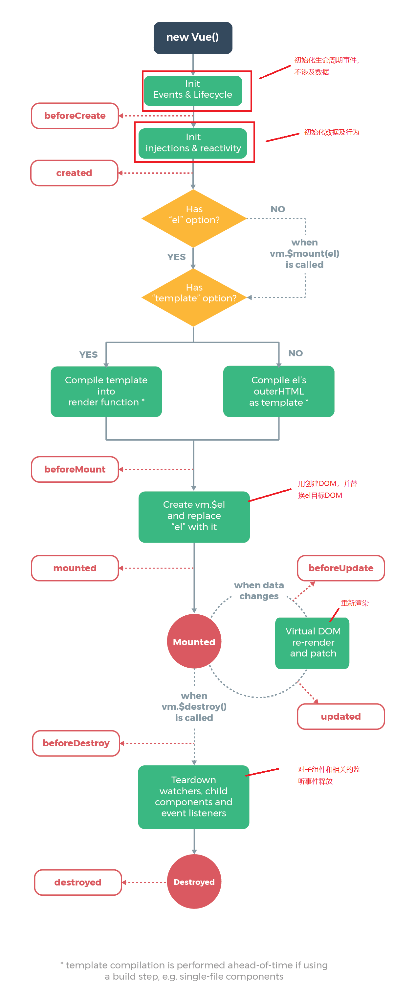

### vue的生命周期钩子函数

> 每个 Vue 实例在被创建时都要经过一系列的初始化过程，例如需要设置数据监听、编译模板、将实例挂载到 DOM 并在数据变化时更新 DOM 等。同时在这个过程中也会运行一些叫做生命周期钩子的函数，这给了用户在不同阶段添加自己的代码的机会。



- beforeCreate &nbsp;&nbsp;&nbsp;&nbsp;组件创建之前
- created &nbsp;&nbsp;&nbsp;&nbsp;&nbsp;&nbsp;&nbsp;&nbsp;&nbsp;&nbsp;&nbsp;&nbsp;&nbsp;组件创建之后

> 使用组件，就会触发以上的事件函数；created中可以操作数据，从而影响页面;应用：发起ajax请求，获取数据。

```javascript
        var lifeCycle = {
            template: `
                <div>生命周期函数</div>
            `,
            data: function() {
                return {
                    text: 'hello,world!'
                }
            },
            beforeCreate: function() {
                // 创建之前
                console.log('创建之前data中的数据：',this.text)
            },
            created: function() {
                //创建之后
                console.log('创建之后data中的数据：',this.text)
            }
        }
```

- beforeMount &nbsp;&nbsp;&nbsp;&nbsp;&nbsp;vue起作用，装载数据到DOM之前
- mounted &nbsp;&nbsp;&nbsp;&nbsp;&nbsp;&nbsp;&nbsp;&nbsp;&nbsp;&nbsp;&nbsp;vue起作用，装载数据到DOM之后

```javascript
            beforeMount: function() {
                // vue起作用，装载数据到DOM之前
                console.log('装载之前：',document.body)
            },
            mounted: function() {
                // vue起作用，装载数据到DOM之后
                console.log('装载之后：',document.body)
            }
```
>> 出现问题： 在beforeMount中输出的DOM已经装载完成，不清楚原因

- beforeUpdate &nbsp;&nbsp;&nbsp;&nbsp;数据更新之前
- updated &nbsp;&nbsp;&nbsp;&nbsp;&nbsp;&nbsp;&nbsp;&nbsp;&nbsp;&nbsp;&nbsp;&nbsp;&nbsp;数据更新之后

> 在有数据更改的时候才会触发，beforeUpdate可以获取原DOM，updated可以获取更改后的DOM。

- beforeDestroy&nbsp;&nbsp;&nbsp;&nbsp;&nbsp;组件销毁之前
- destroyed&nbsp;&nbsp;&nbsp;&nbsp;&nbsp;&nbsp;&nbsp;&nbsp;&nbsp;&nbsp;&nbsp;&nbsp;组件销毁之后

> v-if控制着组件的销毁和创建,频繁的创建和销毁组件并不合理因此Vue就存在一个内部组件keep-alive。

##### keep-alive组件

> 当带有v-if的子组件被放在<keep-alive></keep-alive>组件中，就不会再被创建和销毁，而是缓存起来，被激活和停用。

```javascript
<keep-alive>
    <life-cycle v-if="isExist"></life-cycle>
</keep-alive>
```

- activated&nbsp;&nbsp;&nbsp;&nbsp;&nbsp;&nbsp;&nbsp;&nbsp;&nbsp;&nbsp;&nbsp;&nbsp;&nbsp;&nbsp;组件的激活
- deactivated&nbsp;&nbsp;&nbsp;&nbsp;&nbsp;&nbsp;&nbsp;&nbsp;&nbsp;&nbsp;组件的停用

